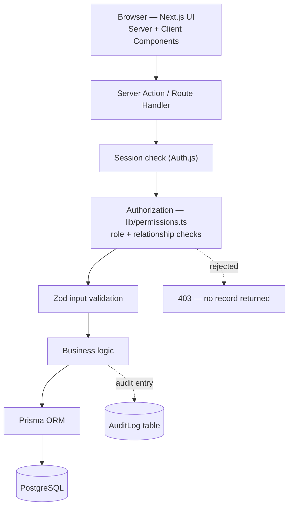
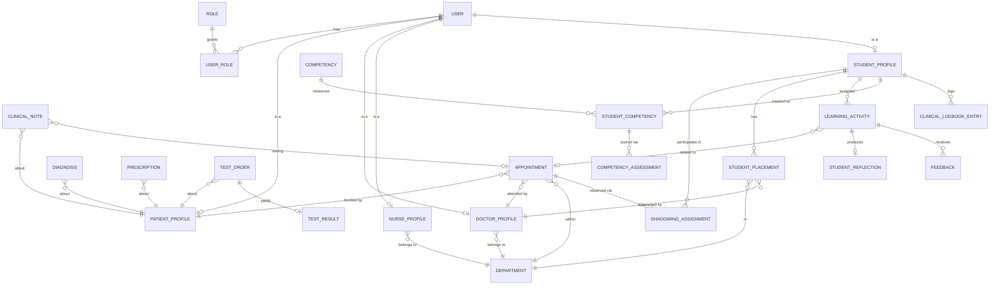

# Architecture — Teaching Hospital Platform

A hospital management system and a medical-student clinical-education
platform, sharing one backend, one database, and one permission model.

> **Portfolio / educational project.** All data is fictional. Not intended
> for real patient data, real diagnoses, or any real clinical use.

## 1. Product requirements

The system has two halves that interlock through one relationship:

1. A **patient** books an appointment with a **doctor** in a **department**.
2. **Hospital side:** the doctor runs the appointment, writes clinical
   notes, diagnoses, and prescriptions.
3. **Education side:** a supervisor may attach a **student** to that same
   appointment as a scoped, read-only observer.
4. The **student** reflects on what they observed; the supervisor reviews
   and scores competencies.

Functional scope, grouped by what should visibly work in the finished repo:

- **Identity & access** — registration (patients only; staff/students are
  provisioned by an admin), login, logout, password reset, per-role
  dashboards.
- **Hospital core** — departments, patient profiles, doctor/nurse profiles,
  appointment lifecycle, clinical notes, diagnoses, prescriptions, test
  orders/results, documents.
- **Education core** — student profiles, placements/rotations, shadowing
  assignments scoped to specific appointments, learning activities,
  reflections, supervisor feedback, competency tracking, a logbook computed
  from real records.
- **Cross-cutting** — notifications, internal messaging, audit logging,
  search, role-aware dashboards.

**Scope decision:** this is a genuine multi-month build. The
[roadmap](#12-development-roadmap) sequences it so Phase 1 produces a real,
demoable, authenticated CRUD + RBAC hospital system before the education
layer is added on top — a legitimate checkpoint, not an all-or-nothing
project.

## 2. Roles & permissions

Seven roles, stored as rows in a `Role` table and linked to users through a
`UserRole` join table — **not** a single `role` column on `User`. In a
teaching hospital, a doctor is very often also a supervisor; a join table
lets one real person hold multiple roles honestly instead of forcing a fake
second account.

Legend: **Full** = create/read/update/delete within their domain · **Scoped**
= only records they're directly related to · **Read** = view-only, often a
restricted field subset · **—** = no access.

| Resource | SysAdmin | Hospital Admin | Doctor | Nurse | Supervisor | Student | Patient |
|---|---|---|---|---|---|---|---|
| Users & roles | Full | Scoped (non-admin) | — | — | — | — | — |
| Departments | Full | Full | Read | Read | Read | Read | Read |
| Patient profile | — | Full | Scoped (own) | Scoped (dept) | — | Read (shadow scope) | Scoped (own) |
| Appointments | — | Full | Scoped (own) | Scoped (dept) | Read (their students') | Read (own shadowing) | Scoped (own) |
| Clinical notes / diagnoses / prescriptions | — | Read (oversight) | Scoped (own patients) | Read (per protocol) | — | — (never writes) | Read (own, permitted) |
| Student placements | — | Full | — | — | Scoped (own students) | Read (own) | — |
| Shadowing assignments | — | Read | Scoped (own appts) | — | Scoped (own students) | Read (own) | — |
| Learning activities & reflections | — | — | — | — | Scoped (own students) | Scoped (own) | — |
| Competencies & assessments | Full (catalog) | Full (catalog) | — | — | Scoped (assess own) | Read (own) | — |
| Audit logs | Full | Read (non-technical) | — | — | — | — | — |

**Deviation from the original brief:** "Supervisor" is modeled as a
*capability* a Doctor or senior Nurse profile can hold (`canSupervise:
boolean`), not a standalone profile table — a bare Supervisor account with
no clinical profile has nothing to supervise students on.

## 3. System architecture



Every box runs server-side. The browser never decides what a user is
allowed to see — it only renders what the server already filtered. That
rule is what makes the security test cases in [Section 10](#10-security-architecture)
testable: each one is "call the server action directly with the wrong
session, confirm it refuses."

There is deliberately **no separate backend service** — Next.js's server
runtime (Server Actions + Route Handlers) is the whole backend. A standalone
backend would make sense with independent scaling needs, a second client
(e.g. native mobile), or heavy background jobs — none of which apply here,
and splitting it out now would add deployment complexity without teaching
anything this project needs.

The hospital and education halves connect at exactly three points:
`Appointment` (via `ShadowingAssignment`), `User` (a person can hold both a
clinical and an educational role), and `Department` (both placements and
appointments belong to one).

## 4–6. Data model & ERD

### Identity

`User` → `Role` (via `UserRole`) → one optional profile table per domain:
`PatientProfile`, `DoctorProfile`, `NurseProfile`, `StudentProfile`. A user
only gets the profile rows matching the roles they actually hold.

### Hospital core

`Department` is a real table, not a hardcoded enum — it's referenced by
staff, appointments, and placements alike. `Appointment` is the hub:
patient, doctor, department, status, time. Clinical output is split into
distinct tables — `ClinicalNote`, `Diagnosis`, `Prescription`,
`TestOrder`/`TestResult`, `Document` — each with its own shape, author,
patient, and optional appointment link, rather than one generic polymorphic
"MedicalRecord" table (shorter to write today, much worse to query, index,
or explain in an interview).

### Education core

`StudentPlacement` (a rotation: student, department, supervisor, date
range) is distinct from `ShadowingAssignment` (a specific student observing
a specific appointment, with its own access level) — a student can be
placed in Cardiology for a month while only shadowing three specific
appointments within it. `LearningActivity` ties optionally to an
appointment, produces one `StudentReflection`, and can receive multiple
`Feedback` entries. Competency tracking is three tables: `Competency` (the
catalog), `StudentCompetency` (current standing), and
`CompetencyAssessment` (the append-only scoring history that standing is
derived from).

### Logbook — computed, not stored as a counter

`ClinicalLogbookEntry` rows are the source of truth. "32 clinical
encounters, 74 hours" is a `COUNT`/`SUM` query over this table at render
time — never a manually incremented field.



*(Secondary tables — `Message`, `Document`, `Notification`, `AuditLog` —
omitted from the diagram for legibility; they're simple FK-to-`User`/
`Patient` tables, described in `prisma/schema.prisma`. `Document` is the
one table in this schema with no application code behind it at all —
see [Known limitations](#known-limitations).)*

## 7. Technology stack

| Layer | Choice | Why |
|---|---|---|
| Frontend | Next.js 16 (App Router) + TypeScript + Tailwind | Same stack as the portfolio project — deepens one skillset instead of fragmenting across frameworks mid-learning. |
| Backend | Server Actions (primary), Route Handlers only where needed | Colocated, fully typed end-to-end, no separate API contract to maintain for internal mutations. |
| Database | PostgreSQL on Neon | Data is relational to its core — FKs everywhere, multi-table joins on every dashboard. Neon integrates natively with Vercel and has a real free tier. |
| ORM | Prisma | Schema-first, fully typed queries, built-in migrations; the schema file doubles as readable documentation. |
| Auth | Auth.js (NextAuth v4), Credentials provider, **JWT sessions + DB-checked revocation**, bcrypt | See below. |
| UI | Tailwind + shadcn/ui | shadcn components are copied into the repo, not installed as an opaque dependency — every dashboard/table/dialog used is code that can actually be read and modified. |
| Charts | Recharts | Competency bars, admin dashboard metrics. |
| Testing | Vitest (unit/integration) + Playwright (E2E) | Integration tests hit the real dev database directly — no mocked Prisma client — because the thing worth testing here is authorization logic, which a mock can't meaningfully verify. Playwright drives an actual browser against a production build for the handful of bugs (crashes, dialogs that never mount) no server-side test can see. |
| Deployment | Vercel (app) + Neon (database) | Same as the portfolio; both have a real free tier. |

### Authentication, in full

Two real options existed: a managed provider (Clerk, Auth0) or **Auth.js
with a Credentials provider** against our own `User` table. Managed auth is
faster and offloads real security surface area — legitimate for a
client project under deadline — but it would hand the exact mechanics this
project exists to teach (password hashing, session issuance, the RBAC
layer) to a black box.

**Original decision: Auth.js, database sessions (not JWT), bcrypt for
hashing.** Database sessions over JWT specifically because they're
revocable instantly by deleting the session row — in a system simulating
healthcare access, "immediately kill this person's access" is a real
requirement, and JWTs can't do that without a parallel revocation list.

**Revised during Stage 3, after implementation surfaced a real framework
constraint:** `next-auth` resolved to the stable v4 line (v5/Auth.js is
still pre-release). Reading v4's actual callback source showed that its
Credentials provider *always* issues a JWT-signed cookie directly —
`core/routes/callback.js` calls `jwt.encode()` unconditionally for
`provider.type === "credentials"` and never touches the adapter's
`createSession`/database-session methods, regardless of the configured
`session.strategy`. Database sessions in v4 only ever apply to OAuth-style
providers going through the adapter, which doesn't fit a Credentials-only
app.

Rather than fight the framework or depend on an unstable v5 beta for a
portfolio project, the revocability *goal* is kept, implemented
differently: **JWT sessions, with the `jwt` callback re-checking
`isActive`/`roles` against the database on every request** instead of
trusting the token's stale copy. Deactivating a user still takes effect on
their very next request — same outcome, no adapter, no unstable
dependency. The `@auth/prisma-adapter` package was installed, evaluated,
and removed once this was confirmed; it isn't used.

## 8. Folder structure

The structure below reflects the repo as it actually stands after all five
phases, not the Phase 0 plan — a few things moved as the shape of the app
became clearer (no `(auth)` route group ended up being necessary; `actions/`
and `components/` both ended up with one file/folder per route area rather
than the coarser domain grouping originally sketched; `database-schema.md`
and `security.md` were never split out as separate files, since Sections
4–6 and 10 of this one document already cover that ground without forcing
a reader to jump between files).

```
teaching-hospital-platform/
├─ prisma/
│  ├─ schema.prisma
│  ├─ seed.ts                  # fictional demo data generator
│  └─ migrations/
├─ app/
│  ├─ page.tsx                  # landing page
│  ├─ login/  register/
│  ├─ error.tsx  not-found.tsx
│  ├─ (dashboard)/
│  │  ├─ layout.tsx             # role-aware sidebar + topbar shell
│  │  ├─ dashboard/  appointments/[appointmentId]/  activities/[activityId]/
│  │  ├─ placements/  messages/  logbook/  competencies/  patient/profile/
│  │  └─ admin/  departments/  staff/  patients/  students/
│  └─ api/auth/[...nextauth]/route.ts
├─ actions/                     # server actions, one file per route area
│  ├─ auth.ts  users.ts  staff.ts  patients.ts  students.ts  departments.ts
│  ├─ appointments.ts  clinical-records.ts
│  ├─ placements.ts  shadowing.ts  learning-activities.ts  competencies.ts
│  ├─ logbook.ts  dashboard.ts
│  └─ notifications.ts  messages.ts  search.ts
├─ lib/
│  ├─ auth.ts                   # Auth.js config
│  ├─ permissions.ts            # the one place authorization logic lives
│  ├─ audit.ts                  # audit log helper, called from every mutation
│  ├─ notifications.ts          # notify() helper, mirrors audit.ts
│  ├─ prisma.ts                 # Prisma client singleton
│  ├─ password.ts  format-date.ts  appointment-status.ts  activity-status.ts
│  └─ utils.ts
├─ components/
│  ├─ ui/                       # shadcn/Base UI primitives
│  ├─ dashboard/                # sidebar, mobile nav, topbar, search, notifications
│  └─ appointments/  activities/  admin/  competencies/  logbook/
│     messages/  patient/  placements/   # one folder per route area, mirroring actions/
├─ tests/
│  ├─ unit/  integration/  e2e/
└─ docs/
   └─ architecture.md            # this document
```

Zod schemas live inline at the top of the action file that uses them, not
in a separate `validation/` folder as originally planned — with one schema
per server action and no schema ever shared across files, the extra
indirection wasn't earning its keep.

The split between `actions/` (what happens) and `lib/permissions.ts` (who's
allowed) is the most important structural decision — every action file
reads the same way: check permission, validate input, do the thing, log it.

## 9. API / server action architecture

One concrete example — *"a doctor adds a clinical note during an
appointment"* — every mutation follows this shape. Each action module
splits the work into a `*ForUser` function that takes a resolved session
as a plain parameter (directly unit-testable, no request/cookies needed —
see `tests/integration/`) and a thin `"use server"` wrapper that resolves
the session and delegates:

```ts
// actions/clinical-records.ts
export async function addClinicalNoteForUser(
  user: SessionUser,
  input: AddClinicalNoteInput,
) {
  const data = addClinicalNoteSchema.parse(input)         // 1. valid shape?
  const { appointment, canEdit } =
    await getAppointmentForUser(user, data.appointmentId) // 2. exists, and allowed?
  if (!canEdit) throw new AuthorizationError(…)            // relationship check,
                                                            // not just "is a doctor"
  const note = await prisma.clinicalNote.create({ data: {  // 3. do it
    ...data, patientId: appointment.patientId, authorId: user.id,
  }})

  await audit({                                            // 4. log it
    actorId: user.id,
    action: "CREATED_CLINICAL_NOTE",
    entityType: "ClinicalNote",
    entityId: note.id,
  })
  return note
}

export async function addClinicalNote(input: AddClinicalNoteInput) {
  const user = await requireUser()
  return addClinicalNoteForUser(user, input)
}
```

`getAppointmentForUser`'s own relationship check is where the real
authorization lives — it doesn't just check "is this a doctor," it checks
"is this doctor the one assigned to this specific appointment." That's
role-based access control versus the real thing: a Cardiology doctor
should not be able to write a note on a Dermatology patient they've never
seen.

Only a handful of Route Handlers exist outside this pattern: the Auth.js
callback route (required by the library) and nothing else.

## 10. Security architecture

- **Passwords** — bcrypt, never reversible, never logged, never returned
  from any query.
- **Sessions** — JWT-based (see Section 7 for why database sessions
  weren't an option with next-auth v4's Credentials provider), with the
  `jwt` callback re-checking `isActive`/roles against the database on
  every request — deactivating a user still revokes access on their very
  next request, without a deletable session row.
- **Authorization** — centralized in `lib/permissions.ts`, called at the
  top of every server action. The UI hides buttons a user can't use, but
  that's cosmetic — the server check is what's tested and what matters.
- **Input validation** — zod schema at every action boundary.
- **Audit logging** — append-only `AuditLog` table, written by one helper
  from every sensitive mutation and patient-record view, built from Phase 0
  rather than bolted on later.
- **Database constraints** — FKs, `NOT NULL`, enums enforced in Postgres
  itself, not just application code. Defense in depth.
- **Secrets** — `.env.local` (gitignored), `.env.example` committed with
  placeholder values.

Three specific test scenarios become the core of the authorization test
suite:

1. Can a student reach a patient record outside an authorized shadowing
   assignment?
2. Can a patient reach another patient's data?
3. Can an unauthorized user modify a clinical record?

**Deviation from the original brief:** testing and security review were
listed near the end of the stage list (stages 20–21). Authorization tests
in particular are written *alongside* each permission-sensitive feature as
it ships (see [roadmap](#12-development-roadmap)) — not deferred to a
single stage after the threat model has been forgotten.

## 11. Core user workflows

**Booking → treatment**

1. Patient selects a specific doctor and requests an appointment — status
   `Scheduled`. (Implemented in Phase 1 Stage 4 as doctor-selection, not
   department-only — `Appointment.doctorId` is a required FK from Phase 0,
   so the doctor has to be known at creation time. Equally realistic;
   see the Phase 1 Stage 4 note in the deviations summary.)
2. Hospital Admin or the assigned doctor confirms — status `Confirmed`.
3. Doctor runs the appointment — `In Progress` → adds notes/diagnosis/
   prescription (Stage 5) → `Completed`.
4. Patient sees permitted record fields and any follow-up on their
   dashboard.

**Shadowing → learning → feedback**

1. Supervisor creates a `ShadowingAssignment` linking a student to a
   specific confirmed appointment, with a defined access level.
2. Student sees it on their dashboard; only permitted fields of that one
   patient become visible.
3. Student observes, then submits a reflection against the related
   `LearningActivity`.
4. Supervisor reviews, leaves feedback, optionally updates a
   `CompetencyAssessment` — recalculating the student's `StudentCompetency`
   standing.
5. Student sees updated competency bars and logbook totals, both derived
   from real rows.

## 12. Development roadmap

Resequenced from the original 24-stage list into 5 phases, around one idea:
**get to a real, reviewable, authenticated system fast**, then layer the
education platform on top of a foundation that's already correct.

| Phase | Contents |
|---|---|
| **0 — Foundations** | Project setup → database schema → authentication → core RBAC (incl. the audit-log helper, built now rather than at the old stage 19). |
| **1 — Hospital core** | See the Stage 1–6 breakdown below. Authorization tests ship alongside each feature. **Checkpoint: a working, authenticated, RBAC-enforced hospital CRUD system — demoable on its own.** |
| **2 — Education platform** | See the Stage 1–6 breakdown below. |
| **3 — Cross-cutting** | Notifications → internal messaging → search → remaining dashboard polish. See the Stage 1–4 breakdown below. (Audit logs already exist from Phase 0.) |
| **4 — Harden & ship** | Admin-assisted password reset → security review → E2E tests → UI/UX polish → deployment hardening → finish docs. See the Stage 1–6 breakdown below. |

### Phase 1 breakdown

Broken into stages the same way Phase 0 was, each one a real demoable
increment rather than a horizontal layer:

| Stage | Contents |
|---|---|
| 1 | Dashboard shell (sidebar/topbar, role-aware nav) + shadcn/ui setup. First real feature: Department CRUD (admin-only) — proves the action → permission → audit → table → form pattern on the simplest possible domain object. |
| 2 | Staff management: admin creates Doctor/Nurse accounts, views/deactivates staff. First real UI for Phase 0 Stage 4's `deactivateUser`. |
| 3 | Patient management: admin patient list; patient self-service profile (emergency contact, blood type, allergies — deliberately skipped at registration). Doctor/Nurse "my patients" scoping is *not* finished here — it's only meaningful once appointments exist. |
| 4 | Appointments: booking (patient selects a doctor directly — see deviations), full status lifecycle, per-role list views. Establishes Doctor/Nurse patient scoping, since "assigned patients" is defined through appointments. |
| 5 | Clinical records: notes, diagnoses, prescriptions, test orders/results, authored by the assigned doctor during/after an appointment. Admin is read-only here (oversight, not edit — the one entity in this app where admin doesn't have full access). Patients see their own records in full; `Document` (file uploads) deferred — no storage provider chosen, nothing else in this phase needs one. |
| 6 | Role dashboards (Admin/Doctor/Patient) with real data — deliberately last, since every widget aggregates data built in Stages 1–5 rather than querying empty tables. Nurse (no dashboard specified in the original brief) falls through to a generic summary. |

### Route protection: proxy.ts + server-side checks, not either alone

Stage 1 surfaced a real Next.js 16 bug: a `redirect()` thrown inside a
Suspense-wrapped dashboard layout produced a correct `NEXT_REDIRECT` digest
(confirmed in server logs) but the response reaching the client stayed a
broken `200` instead — Cache Components' dev-mode "instant UI" validation
pass appears to swallow redirects thrown this way. `instant = false`
(Next's own documented opt-out) didn't resolve it.

**Fix: route protection now happens in two layers.** `proxy.ts` (Next 16
renamed `middleware.ts` → `proxy.ts`, and it now runs on the Node.js
runtime rather than Edge) does a coarse, cheap check — does a valid
session token exist at all — via `next-auth/jwt`'s `getToken()`, before
any of Cache Components' rendering/caching machinery runs, which sidesteps
the bug entirely. The authoritative, DB-fresh `isActive`/role checks
(`requireUser`/`requireRole` in `lib/permissions.ts`) still run in every
layout, page, and server action exactly as designed — the proxy doesn't
replace that, it just catches the common "not logged in at all" case
before it can hit the buggy code path.

**Stage 3 update:** the same bug recurred for role-mismatch redirects — an
authenticated patient hitting an admin-only route still fell through to
the buggy layout-level redirect, since the proxy only checked "is there a
token," not "is this token allowed here." Verified directly against
response bodies that nothing ever leaked — the wrong role just saw a
broken page, never the other role's data — but it's a real UX bug.
`proxy.ts` now also checks role-restricted prefixes (`/admin`, `/patient`)
against the token's embedded `roles` claim, redirecting to `/dashboard`
on mismatch before Cache Components' rendering ever starts. The pattern
holds: proxy catches the common cases cheaply and early; `lib/permissions.ts`
remains the authoritative, DB-fresh backstop for everything else.

### Phase 2 breakdown

Same approach as Phase 1: each stage is a real demoable increment,
sequenced so later stages never depend on data a prior stage hasn't
created yet (can't shadow an appointment before a placement exists;
can't track competencies before an assessment exists to track).

| Stage | Contents |
|---|---|
| 1 | Student management: admin creates Student accounts (student number, university, year, program) — same pattern as Phase 1 Stage 2's Doctor/Nurse creation. Bootstrapping stage; nothing else in Phase 2 is demoable without a real student. |
| 2 | Clinical placements: admin assigns a student to a department + a supervising doctor (`canSupervise = true`, already collected at doctor creation in Phase 1 Stage 2) for a date range. Establishes the specific supervisor-student relationship shadowing depends on — not "any doctor who can supervise," only the one actually assigned. |
| 3 | Shadowing: a supervisor assigns a placed student to shadow a specific appointment (`ShadowingAssignment`). Extends the Phase 1 Stage 5 appointment/clinical-record access checks with a new case: a student with an active shadowing assignment for an appointment gets **read access to `ClinicalNote` and `Diagnosis` only** — not `Prescription` or `TestResult`. Decided explicitly (not a default): the original brief was emphatic that shadowing access must be scoped, not full record parity, and notes/diagnosis carry the observational/educational value without the more sensitive treatment specifics. |
| 4 | Learning activities, reflections & feedback: supervisor assigns activities (optionally tied to a shadowing session); student completes them and submits a `StudentReflection`; supervisor reviews and records `Feedback` (rating, strengths, areas for improvement). |
| 5 | Clinical logbook & competency tracking: a `ClinicalLogbookEntry` is created automatically when a shadowed appointment transitions to `COMPLETED` — tied to a real event, not manual entry, matching the brief's "calculated from database records, not fake numbers." Supervisors record `CompetencyAssessment`s against the catalog seeded in Phase 0 (Communication, Patient History Taking, Clinical Observation, Professional Conduct); students see progress derived from assessment history. |
| 6 | Student dashboard: today's activities, upcoming shadowing, clinical hours, competency progress, pending reflections, current placement — aggregating Stages 1–5, same "dashboards last" reasoning as Phase 1 Stage 6. The existing Doctor dashboard (Phase 1 Stage 6) gets extended with a "my students" section for supervisors rather than building a separate supervisor portal. |

### Phase 3 breakdown

Unlike Phases 1 and 2, these four stages aren't a dependency chain — each
is an independent cross-cutting concern touching many existing modules
rather than building new ones from scratch. Sequenced in the order the
roadmap table already commits to (notifications → messaging → search →
dashboard polish), but any could run in a different order without
breaking the next.

Two scope decisions made explicit before starting:

- **No email delivery.** Notifications are in-app only (a `Notification`
  row + a bell icon in the topbar), the same way `Document` file uploads
  stayed deferred in Phase 1 Stage 5 — no email provider has been chosen
  anywhere in this project, and adding one now, for this alone, would be
  scope the brief never asked for.
- **Messaging is relationship-scoped, not an open directory** (confirmed
  with the user before starting): a patient can only message their own
  assigned doctor(s); a student can only message their current/past
  supervisor(s); doctors, nurses, and admins can message each other
  freely as staff; admin can message anyone. This matches how every
  other feature in this app is scoped by an actual relationship
  (appointment, placement) rather than open access — an open directory
  would be the first feature in the whole system that isn't.

| Stage | Contents |
|---|---|
| 1 | Notifications: `lib/notifications.ts` (`notify()`, mirrors `lib/audit.ts`'s `audit()`) + `actions/notifications.ts` (list, unread count, mark-read/mark-all-read) + a bell icon with an unread badge and dropdown panel in the shared `Topbar`. Wired into real existing events, not invented ones: appointment requested (→ the assigned doctor), appointment confirmed/cancelled/completed (→ the patient, and → the doctor when the patient cancels), shadowing assigned (→ the student), learning activity assigned (→ the student), reflection submitted (→ the supervisor), feedback given (→ the student), competency assessed (→ the student), placement created (→ both student and supervisor). |
| 2 | Internal messaging: `actions/messages.ts` — a relationship-scoped recipient picker (per the decision above), send, inbox, sent, mark-read. `/messages` page (inbox/sent) + compose dialog + an unread badge on the nav item. |
| 3 | Search: a single topbar search input fanning out to a handful of entities (patients, doctors, students, appointments), each query reusing the exact same authorization scoping its existing list action already enforces (a nurse's search for "patients" can't surface more than their own department already shows on `/admin/patients` — there is no new unscoped "search everything" path). Results grouped by type, linking to the existing detail/list pages. |
| 4 | Dashboard polish: a real Nurse dashboard (department-scoped today's/upcoming appointments, reusing the existing `NURSE` branch of `listAppointmentsForUser`'s scoping) — closing the gap Phase 1 Stage 6 explicitly left open ("no dashboard specified in the original brief" was true then; nothing else in this phase needs it, so it's picked up here instead of invented mid-Phase-1). |

### Phase 4 breakdown

Like Phase 3, these six stages are independent concerns rather than a
dependency chain, sequenced roughly build-time-first (fix/add
functionality) before ship-time (verify deployment, finish docs) —
docs genuinely come last here, since this is the one phase whose own
job is to leave the README/architecture doc in their final state, not
because they were neglected earlier.

One gap found while scoping this phase, plus a decision made explicit
before starting:

- The original brief listed **password reset** under Identity & access
  (Section 1), but it was never built in Phases 0-3. No email provider
  has been chosen anywhere in this project — the same reason
  notifications (Phase 3 Stage 1) and `Document` file uploads (Phase 1
  Stage 5) both stayed deferred — and self-service reset normally
  needs email to verify identity without one. **Decided with the user:**
  an admin-assisted reset (admin sets a new password for a user,
  communicated out-of-band), consistent with how staff/student
  accounts are already admin-provisioned rather than self-service,
  rather than introducing an email provider this late or dropping the
  requirement silently.
- **Confirmed with the user:** the GitHub repo is already connected to
  a live Vercel project, auto-deploying on every push to main. Stage 5
  (deployment) is therefore a hardening/verification pass against that
  existing pipeline, not initial setup — and it's real work, not just
  a checklist: `package.json`'s `build` script is currently plain
  `next build` with no `prisma migrate deploy` step, and
  `next.config.ts` sets no security headers at all yet.

| Stage | Contents |
|---|---|
| 1 | Admin-assisted password reset: an admin can set a new password for any user, following the eligibility/audit pattern already used for `deactivateUser` — closes the Identity & access gap above without a new external dependency. |
| 2 | Security review & hardening: a systematic re-audit of every authorization boundary accumulated across Phases 0-3 (role checks, ownership/relationship checks, IDOR potential on every `[id]` route and action), plus `next.config.ts` security headers (CSP, `X-Frame-Options`, `Referrer-Policy`, HSTS) and a secrets/env-hygiene pass (`.env.example` completeness, `NEXTAUTH_SECRET` strength). |
| 3 | E2E tests: install and configure Playwright (not yet a real dependency despite being named in the tech stack), covering critical user journeys end-to-end through actual rendered pages rather than direct action calls — login, a patient booking and a doctor completing an appointment with clinical records, a supervisor assigning shadowing through to a student's reflection and feedback, admin account provisioning. |
| 4 | UI/UX polish: a real mobile navigation (the `Sidebar` is currently `hidden` below the `md` breakpoint with no replacement at all — a genuine gap, not polish-level nitpicking), an accessibility pass (keyboard navigation, ARIA labels, focus states, contrast), and consistent empty/loading states and error/404 pages across pages that have drifted stage-to-stage. |
| 5 | Deployment hardening: wire `prisma migrate deploy` into the production build step, apply the Stage 2 security headers, confirm production environment variables against `.env.example`, and smoke-test the live deployment end-to-end once Stages 1-4 have shipped. |
| 6 | Finish docs: a final top-to-bottom accuracy pass on README/architecture.md/ERD (not a rewrite — both have been kept current stage-by-stage throughout), plus an explicit "known limitations" section listing every deliberate scope cut made along the way (admin-only password reset, no file uploads, in-app-only notifications, etc.) so a reviewer sees them as decisions, not gaps. |

## Summary: deviations from the original brief

- Supervisor modeled as a capability on Doctor/Nurse, not a separate
  profile table.
- Medical records split into distinct typed tables instead of one generic
  polymorphic table.
- No generic fine-grained `Permission` row-table — role + relationship
  checks in code cover every case without the extra indirection.
- Audit logging built in Phase 0, not deferred.
- Authorization tests written alongside each feature, not deferred to one
  final testing stage.
- JWT sessions with DB-checked revocation, not true database sessions —
  reversed in Stage 3 once implementation showed next-auth v4's Credentials
  provider never uses the adapter's database-session path regardless of
  config. Same revocability outcome, different mechanism (see Section 7).
- Phase 1 Stage 4: patients select a specific doctor when booking, rather
  than requesting a department and having staff assign a doctor later —
  `Appointment.doctorId` is a required FK from the Phase 0 schema, so
  deferred doctor assignment isn't possible without a migration. Doctor
  selection is an equally realistic booking pattern; not changed.
- Phase 1 Stage 5: the permissions matrix's "permitted subset" phrase for
  patient read access on clinical records is interpreted as "their own
  records, in full" rather than field-level redaction — nothing else in
  the data model has per-field visibility flags, and adding one would be
  speculative scope beyond what's actually specified anywhere.
- Phase 2 Stage 3: building shadowing access surfaced that
  `listAppointmentsForUser` had no `STUDENT` branch at all — students got
  `AuthorizationError` hitting `/appointments` regardless of any
  shadowing assignment, a gap left over from Phase 1 Stage 4 before
  students existed as a role that needed appointment access. Fixed by
  adding a branch scoped to appointments with an active
  `ShadowingAssignment` for that student, consistent with every other
  role's scoping in that function.
- Phase 2 Stage 3: the notes-and-diagnosis-only scoping for shadowing
  students is enforced in `getAppointmentRecordsForUser` by skipping the
  `Prescription`/`TestOrder` queries entirely for that case (returning
  `[]` without ever running them), not by querying everything and
  filtering the response. Confirmed live against the dev database: a
  doctor's view of an appointment shows a real prescription; the
  shadowing student's view of the same appointment shows the note and
  diagnosis but has no prescription section at all.
- Phase 2 Stage 4: added `LearningActivity.supervisorId` (migration
  `20261009073255_learning_activity_supervisor`), not in the original
  Phase 0 schema. That schema only recorded `studentId` on the activity,
  with no field recording which supervisor assigned it -- a student can
  have more than one supervisor over time across sequential placements,
  so "the student's current supervisor" isn't a safe stand-in for "the
  doctor who actually assigned this activity." Fixed with an additive
  migration rather than inferring it, since the table was still empty
  (feature unbuilt) and inference would have silently misattributed
  activities the moment a student changed supervisors.
- Phase 2 Stage 4: the activity status machine (`ASSIGNED` →
  `IN_PROGRESS` → `COMPLETED` → `REVIEWED`) is enforced by tying each
  transition to the action that causes it, not as a free-standing status
  update: `COMPLETED` only happens as part of creating the
  `StudentReflection` (same transaction), and `REVIEWED` only happens as
  part of creating the `Feedback` row (same transaction). This mirrors
  the existing `Appointment.status` transition-table pattern from Phase 1
  Stage 4, but here the transition is inseparable from the record that
  justifies it -- there's no code path that marks an activity reviewed
  without an actual `Feedback` row to show for it.
- Phase 2 Stage 5: `ClinicalLogbookEntry` has no manual-entry path at
  all -- the brief required the logbook to be "calculated from database
  records, not fake numbers," so the only place one is ever created is
  inside `updateAppointmentStatusForUser`, when an appointment
  transitions to `COMPLETED`, for every student with a
  `ShadowingAssignment` on it. Only `OBSERVED_CONSULTATION` is
  auto-generated; the other three `LogbookEntryType` values (`ENCOUNTER`,
  `EMERGENCY_OBSERVATION`, `PROCEDURE_OBSERVED`) would need an
  appointment-type distinction that doesn't exist anywhere in the
  schema, and adding one now would be speculative scope.
- Phase 2 Stage 5: `StudentCompetency.currentLevel` always reflects the
  most recent `CompetencyAssessment` score, not a computed average or
  max -- consistent with how `LearningActivity.status` and
  `Appointment.status` are both "latest known state," not aggregates,
  everywhere else in this schema.
- Phase 2 Stage 6: writing the dashboard test fixture surfaced that the
  student dashboard's "upcoming shadowing" query filtered appointments
  by `scheduledAt >= now` only, with no status check. Completing an
  appointment doesn't rewrite its `scheduledAt`, so a completed
  appointment with a future timestamp could still show up as
  "upcoming." Fixed by excluding `CANCELLED`/`COMPLETED`/`NO_SHOW`,
  mirroring how the doctor and patient dashboards' own "upcoming
  appointments" queries already filter status -- this query was simply
  new and hadn't had the same filter added yet.

Phase 2 is now complete (Stages 1-6).

- Phase 3 Stage 1: `markNotificationReadForUser` uses `updateMany`
  scoped to `{ id, userId: user.id }`, not `update` on the id alone --
  marking someone else's notification read fails as a silent no-op
  rather than a thrown error that would confirm whether that
  notification id exists at all. Same "don't leak existence" instinct
  as `appointments.ts`/`activities` using `notFound()` for both
  "doesn't exist" and "exists but forbidden," applied to a write
  instead of a read.
- Phase 3 Stage 1: notifications are in-app only -- no email provider
  has been chosen anywhere in this project, the same reason `Document`
  file uploads stayed deferred in Phase 1 Stage 5. `notify()` mirrors
  `audit()`: a single helper called from inside the action that causes
  the event, not a generic event bus.
- Phase 3 Stage 2: messaging is relationship-scoped, not an open
  directory (confirmed with the user before building this stage,
  mirroring the same decision already made for shadowing visibility in
  Phase 2 Stage 3): a patient can only message a doctor they've had an
  appointment with; a student can only message their own
  supervisor(s); staff can message each other freely; admin can
  message anyone. The relationship is symmetric and derived from
  existing `Appointment`/`StudentPlacement` rows in both directions --
  a doctor's own patients and own supervised students appear in
  *their* recipient list too, not invented as a one-way "only the
  patient can start it" rule.
- Phase 3 Stage 3: search has no per-entity detail page to link to for
  Patients/Staff/Students/Doctors (only Appointments has one) -- those
  categories link to the existing list page (`/admin/patients`, etc.)
  instead, since no detail route exists anywhere in the app for those
  entities yet. "Doctors" as a search category only applies to a
  patient's view (the existing booking list from
  `listDoctorsForBookingForUser`); for admin, doctors surface under
  the same "Staff" category the admin staff page already groups them
  under, rather than inventing a separate admin-only "Doctors" split
  that doesn't exist anywhere else in the UI.
- Phase 3 Stage 4: `getNurseDashboardForUser` closes the gap Phase 1
  Stage 6 explicitly left open ("no dashboard specified in the
  original brief" was true then). Scoped by `departmentId` rather than
  `doctorId`, reusing the same scoping the `NURSE` branch of
  `listAppointmentsForUser` already proved correct back in Phase 1
  Stage 4.
- Recurring discovery across Stages 2 and 4 of this phase (worth
  calling out once, since it hit twice): a test or live-check fixture
  that creates a `DOCTOR`/`NURSE` user via `doctorProfile`/
  `nurseProfile` alone, without also assigning the matching `Role` row
  the way `actions/staff.ts` actually does at account creation, ends
  up with a session that has no roles at all once anything queries the
  database's `UserRole` table directly (the messaging staff list in
  Stage 2) or once the role check runs against real session data
  instead of a hand-constructed `SessionUser` (the live dashboard check
  in Stage 4). Not an application bug either time -- both times the
  fixture just hadn't mirrored how a real staff account actually gets
  created.

Phase 3 is now complete (Stages 1-4).

- Phase 4 Stage 1: `resetPasswordForUser` is the admin-assisted
  password reset decided with the user (see the Phase 4 breakdown
  above) -- it mirrors `deactivateUserForUser`'s exact shape
  (admin-only, self-target blocked, one audit entry) rather than
  inventing a different authorization pattern for the one admin action
  that happens to touch a credential. The generated temporary password
  is returned to the caller once and never logged anywhere, including
  the audit entry's own metadata -- confirmed directly in the test
  (`JSON.stringify(entry.metadata)` doesn't contain the plaintext).
- Phase 4 Stage 2: a systematic authorization re-audit (three parallel
  passes covering every action module plus `lib/auth.ts`,
  `lib/permissions.ts`, `proxy.ts`, and both dynamic `[id]` pages)
  found no critical or high-severity issues anywhere, and the
  education platform came back clean outright. Fixed: no guard
  against an admin targeting another admin account via
  `deactivateUser`/`resetPassword`; a systemic pattern across
  `appointments.ts`/`clinical-records.ts`/`shadowing.ts`/
  `learning-activities.ts` where a client-supplied id was fetched via
  `findUniqueOrThrow` *before* the authorization check ran, so a
  nonexistent id and a forbidden id threw two different exception
  types to a direct caller even though the page layer already masked
  the distinction (new `requireFound()` helper in
  `lib/permissions.ts` normalizes this); a timing side-channel in
  `lib/auth.ts`'s `authorize()` that let "no such email" be
  distinguished from "wrong password" by response time; a TOCTOU race
  in `registerPatient`'s email-uniqueness check; `messages.ts`'s
  recipient-eligibility branches being exclusive (if/else-if) instead
  of additive, which would silently under-serve a dual-role account;
  and `requestAppointmentForUser` not checking the target doctor's
  `isActive`. Added security headers (CSP, HSTS, etc.) to
  `next.config.ts`, none of which existed before, and fixed
  `.env.example`, which was missing `NEXTAUTH_SECRET` entirely despite
  both `lib/auth.ts` and `proxy.ts` requiring it.
- **Known limitations, accepted rather than fixed in this stage:** no
  rate limiting anywhere (login, registration) -- would need a new
  external dependency (e.g. Upstash) for a single-instance portfolio
  deployment with no existing abuse signal; no FK-conflict handling on
  department deletion (throws a raw Prisma constraint error if the
  department still has staff/appointments referencing it -- a UX gap,
  not a security one); no `reactivateUser` action, so a deactivation
  is currently irreversible through the UI. None of these are
  authorization bypasses; all three are scope decisions for a
  portfolio project, listed here so they read as decisions rather than
  oversights discovered later.
- Phase 4 Stage 3: Playwright installed and configured (Chromium only
  -- this suite exists to catch real integration breaks in the
  journeys listed in the Phase 4 breakdown above, not to do
  cross-browser compatibility testing), with four specs covering
  login, the full patient-booking-through-doctor-completing-the-visit
  journey, the full supervisor-assigns-shadowing-through-to-feedback
  journey, and admin account provisioning including a password reset.
  Found and fixed two real, previously-undetected bugs that every
  prior verification method in this project (curl, calling action
  functions directly) was structurally incapable of catching because
  neither one clicks a button in a real browser: `DropdownMenuLabel`
  (Base UI's `Menu.GroupLabel`) used outside a `Menu.Group` in
  `Topbar.tsx` and `NotificationBell.tsx`, throwing
  "MenuGroupContext is missing" and crashing the entire account
  dropdown -- including Sign Out -- for every user, since Phase 3
  Stage 1; and all four "Add" dialogs in `ClinicalRecordsPanel.tsx`
  nested inside `SectionShell`'s children, which only render when the
  list is non-empty, so the very first "Add note"/"Add diagnosis"/etc.
  click on a brand-new appointment silently did nothing, since Phase 1
  Stage 5. Also found, root-caused, and fixed a real performance issue
  surfaced by E2E timing rather than by a bug: `getAppointmentRecordsForUser`
  and the appointment detail page were each making two sequential
  Neon round trips where one `Promise.all` would do, which (combined
  with React's `startTransition` keeping the pre-mutation UI on screen
  until the refreshed render is ready) made a just-saved record take
  several real seconds to visibly appear -- confirmed via direct
  database polling that the data itself was never stale, only the
  render. The suite runs against a production build
  (`next build && next start`), not `next dev`, after confirming
  Turbopack's on-demand compilation was the dominant factor in that
  delay; `playwright.config.ts` carries generous timeouts for the same
  reason `vitest.config.mts` already does -- real Neon latency isn't a
  sign anything is wrong. Toast assertions (`toast.success(...)`, which
  auto-dismisses on its own timer) proved racy across several specs;
  replaced throughout with assertions on the actual resulting UI state
  (a dialog closing, a status badge changing, a button appearing) --
  signals tied to the mutation's own success rather than to Sonner's
  independent dismiss timer.
- Phase 4 Stage 4: the mobile navigation gap named in the Phase 4
  breakdown above was real and total -- below the `md` breakpoint the
  `Sidebar` was `hidden` with no replacement, so a signed-in user on a
  phone had no way to move between sections at all except the URL bar.
  Fixed with a `MobileNav` drawer (Base UI's `Dialog` primitives styled
  as a left-side slide-in panel rather than `components/ui/dialog`'s
  centered popup, which would have meant fighting its zoom-in
  animation and positioning classes for no benefit) sharing nav-item
  markup with the desktop `Sidebar` through a new `NavLinks` component
  rather than duplicating it. Opening the drawer revealed the header
  itself didn't fit a phone-width viewport either -- the search input
  was a fixed 256px and the account button always rendered the full
  name -- both made responsive, confirmed with real screenshots at a
  390px viewport, taken by a throwaway Playwright script against the
  demo admin account, deleted after use same as the Stage 3 debug
  scripts.
  Accessibility pass: two real text-on-background contrast failures
  fixed (`text-zinc-400` on a light background in `NotificationBell`'s
  timestamp and `SearchBar`'s category label, both under the ~4.5:1
  WCAG AA threshold for normal text); keyboard focus rings added to
  nav links and search results, which had none; `aria-expanded` added
  to the inbox message toggle; and hiding the account button's name
  text on narrow screens turned out to delete it from the accessibility
  tree too, not just visually -- caught before shipping it, fixed with
  an explicit `aria-label` rather than relying on the hidden span.
  Empty and loading states were audited and found already consistent
  (same `Loading…` fallback and `"No X yet."` phrasing everywhere) --
  not a real gap, so left alone. What was a real gap: no `not-found.tsx`
  or `error.tsx` existed anywhere, so both fell back to Next's bare
  unstyled defaults; added both, matching the login/register pages'
  existing minimal visual language. Also found and fixed `app/page.tsx`
  itself, which had been a literal "Phase 0 — Project setup" wall now
  nine phases out of date -- the first thing anyone evaluating this
  portfolio project would see at the live URL -- replaced with a real
  landing page naming what the project is, with sign-in/register CTAs
  and the seeded demo admin credentials for a reviewer to try it
  immediately.
- Phase 4 Stage 5: wired `prisma migrate deploy` into the `build`
  script (it was plain `next build` before) and documented
  `NEXTAUTH_URL` in `.env.example`, matching the Stage 4 breakdown's
  known gap. The rest of this stage turned out to be less of a
  checklist than expected -- confirming production environment
  variables, the stage's explicit scope, surfaced that the live Vercel
  deployment had **zero** environment variables configured at all, and
  a check of recent deployments showed production builds had in fact
  been failing outright. Root cause of the build failures: no
  `postinstall` script, so `prisma generate` never ran on a fresh
  `npm install` -- the generated client is gitignored like the rest of
  `node_modules`, so it has to be regenerated on every install, and
  every production build was compiling against an ungenerated client,
  cascading into dozens of unrelated-looking TypeScript errors. Fixed
  both: set `DATABASE_URL`/`DIRECT_URL` (reusing the dev Neon
  database), a freshly generated `NEXTAUTH_SECRET`, and `NEXTAUTH_URL`
  in the Vercel dashboard (confirmed with the user before touching
  live infrastructure), and added `"postinstall": "prisma generate"`
  to `package.json`. The first deploy after the env-var fix still
  failed on the missing-client error above; the postinstall fix
  resolved it and the next deploy succeeded.
  Smoke-testing that successful deploy end-to-end (the stage's other
  explicit scope item) surfaced one more real bug: a React hydration
  error (#418) on `/appointments`, caused by `AppointmentsTable` (a
  client component) calling `toLocaleString()` on a date directly in
  its render with no explicit locale/timeZone -- the server (Vercel,
  UTC) and a visitor's browser disagree on the runtime default, so the
  server-rendered and client-hydrated text for the same node differed.
  The same unpinned pattern turned up 30 times across 20 files, not
  just that one; fixed it properly rather than patching only the
  instance that happened to reproduce, via a single
  `lib/format-date.ts` used everywhere a date is displayed. Re-ran the
  live smoke test after that fix shipped: every page checked, desktop
  and mobile, zero console errors.
- Phase 4 Stage 6: final accuracy pass on this document and the
  README. Section 8's folder structure was the one place real drift
  had accumulated -- it was written during Phase 0 planning and never
  revisited, so it still described an `(auth)` route group that was
  never used, an `actions/` split by generic domain name rather than
  route area, a `database-schema.md`/`security.md` split that never
  happened (this document absorbed both instead), and a flat
  `components/domain/` folder where one subfolder per route area
  exists instead. Rewrote it to match the repo as it stands. Added the
  [Known limitations](#known-limitations) section below, consolidating
  scope cuts that were previously only mentioned in passing inside
  individual phase/stage entries above -- the same decisions, just not
  previously collected anywhere a reviewer could find them without
  reading the entire build log.

Phase 4 is now complete (Stages 1-6). All five phases are complete.

## Known limitations

Deliberate scope cuts, not gaps found late. Each one is a decision made
explicitly somewhere in the build log above; collected here so a reviewer
doesn't have to read the whole log to find them.

- **No self-service password reset, no email delivery anywhere.** No email
  provider has been chosen in this project at all. Password reset is
  admin-assisted (Phase 4 Stage 1) the same way staff/student accounts are
  admin-provisioned rather than self-registered; notifications (Phase 3
  Stage 1) are in-app only, no email/push.
- **`Document` (file uploads) is a fully migrated, completely unused
  table.** It's in `schema.prisma` and the ERD from Phase 0, but no
  action or UI was ever built against it (Phase 1 Stage 5) -- no storage
  provider (S3, Vercel Blob, etc.) has been chosen, and nothing else in
  the app needs one.
- **No rate limiting anywhere** (login, registration) -- would need a new
  external dependency (e.g. Upstash) for a single-instance portfolio
  deployment with no existing abuse signal to justify it (Phase 4 Stage 2).
- **No `reactivateUser` action** -- deactivating a user (Phase 1 Stage 2)
  is currently irreversible through the UI; the only fix today is a
  direct database update.
- **No FK-conflict handling on department deletion** -- deleting a
  department that still has staff or appointments referencing it throws a
  raw Prisma constraint error instead of a friendly message (Phase 4
  Stage 2). A UX gap, not a security one.
- **Shadowing access is scoped to notes and diagnoses only**, never
  prescriptions or test results (Phase 2 Stage 3) -- a deliberate reading
  of the brief's "scoped, not full record parity" requirement, not an
  oversight.
- **Search has no detail page for Patients, Staff, Students, or
  Doctors** -- only Appointments has one (Phase 3 Stage 3). Those
  categories link to the existing list page instead, since no detail
  route exists anywhere in the app for those entities.
- **The clinical logbook only auto-generates one of its four entry
  types** (`OBSERVED_CONSULTATION`) -- the other three
  (`ENCOUNTER`, `EMERGENCY_OBSERVATION`, `PROCEDURE_OBSERVED`) would need
  an appointment-type distinction that doesn't exist anywhere in the
  schema (Phase 2 Stage 5).
- **No generic `Permission` row-table** -- role and relationship checks
  live in code (`lib/permissions.ts` and each action module), not as
  configurable database rows. Simpler to read and test for an app whose
  permission rules don't need to be admin-editable at runtime.
- **JWT sessions, not true database sessions** -- next-auth v4's
  Credentials provider doesn't support database sessions regardless of
  configuration (Section 7). Revocability, the actual requirement behind
  "database sessions," is preserved via a DB-fresh `isActive`/roles check
  on every request instead.
- **Single Neon database for both development and production** -- a
  deliberate choice for a portfolio project with only fictional data;
  nothing in this app would benefit from separate environments the way a
  real multi-developer team's app would.
