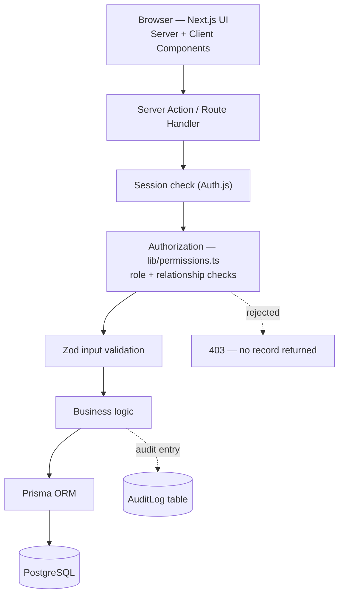
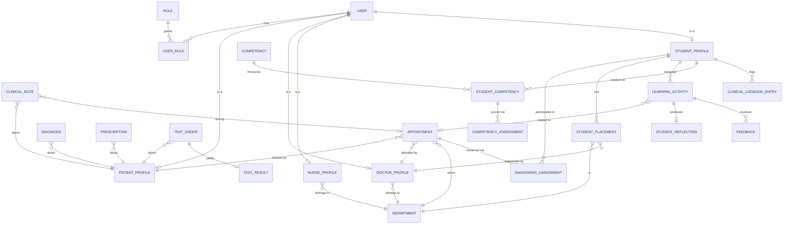

# Architecture — Teaching Hospital Platform

A hospital management system and a medical-student clinical-education
platform, sharing one backend, one database, and one permission model.

> **Portfolio / educational project.** All data is fictional. Not intended
> for real patient data, real diagnoses, or any real clinical use.

## 1. Product requirements

The system has two halves that interlock through one relationship:

1. A **patient** books an appointment with a **doctor** in a **department**.
2. **Hospital side:** the doctor runs the appointment, writes clinical
   notes, diagnoses, and prescriptions.
3. **Education side:** a supervisor may attach a **student** to that same
   appointment as a scoped, read-only observer.
4. The **student** reflects on what they observed; the supervisor reviews
   and scores competencies.

Functional scope, grouped by what should visibly work in the finished repo:

- **Identity & access** — registration (patients only; staff/students are
  provisioned by an admin), login, logout, password reset, per-role
  dashboards.
- **Hospital core** — departments, patient profiles, doctor/nurse profiles,
  appointment lifecycle, clinical notes, diagnoses, prescriptions, test
  orders/results, documents.
- **Education core** — student profiles, placements/rotations, shadowing
  assignments scoped to specific appointments, learning activities,
  reflections, supervisor feedback, competency tracking, a logbook computed
  from real records.
- **Cross-cutting** — notifications, internal messaging, audit logging,
  search, role-aware dashboards.

**Scope decision:** this is a genuine multi-month build. The
[roadmap](#12-development-roadmap) sequences it so Phase 1 produces a real,
demoable, authenticated CRUD + RBAC hospital system before the education
layer is added on top — a legitimate checkpoint, not an all-or-nothing
project.

## 2. Roles & permissions

Seven roles, stored as rows in a `Role` table and linked to users through a
`UserRole` join table — **not** a single `role` column on `User`. In a
teaching hospital, a doctor is very often also a supervisor; a join table
lets one real person hold multiple roles honestly instead of forcing a fake
second account.

Legend: **Full** = create/read/update/delete within their domain · **Scoped**
= only records they're directly related to · **Read** = view-only, often a
restricted field subset · **—** = no access.

| Resource | SysAdmin | Hospital Admin | Doctor | Nurse | Supervisor | Student | Patient |
|---|---|---|---|---|---|---|---|
| Users & roles | Full | Scoped (non-admin) | — | — | — | — | — |
| Departments | Full | Full | Read | Read | Read | Read | Read |
| Patient profile | — | Full | Scoped (own) | Scoped (dept) | — | Read (shadow scope) | Scoped (own) |
| Appointments | — | Full | Scoped (own) | Scoped (dept) | Read (their students') | Read (own shadowing) | Scoped (own) |
| Clinical notes / diagnoses / prescriptions | — | Read (oversight) | Scoped (own patients) | Read (per protocol) | — | — (never writes) | Read (own, permitted) |
| Student placements | — | Full | — | — | Scoped (own students) | Read (own) | — |
| Shadowing assignments | — | Read | Scoped (own appts) | — | Scoped (own students) | Read (own) | — |
| Learning activities & reflections | — | — | — | — | Scoped (own students) | Scoped (own) | — |
| Competencies & assessments | Full (catalog) | Full (catalog) | — | — | Scoped (assess own) | Read (own) | — |
| Audit logs | Full | Read (non-technical) | — | — | — | — | — |

**Deviation from the original brief:** "Supervisor" is modeled as a
*capability* a Doctor or senior Nurse profile can hold (`canSupervise:
boolean`), not a standalone profile table — a bare Supervisor account with
no clinical profile has nothing to supervise students on.

## 3. System architecture



Every box runs server-side. The browser never decides what a user is
allowed to see — it only renders what the server already filtered. That
rule is what makes the security test cases in [Section 10](#10-security-architecture)
testable: each one is "call the server action directly with the wrong
session, confirm it refuses."

There is deliberately **no separate backend service** — Next.js's server
runtime (Server Actions + Route Handlers) is the whole backend. A standalone
backend would make sense with independent scaling needs, a second client
(e.g. native mobile), or heavy background jobs — none of which apply here,
and splitting it out now would add deployment complexity without teaching
anything this project needs.

The hospital and education halves connect at exactly three points:
`Appointment` (via `ShadowingAssignment`), `User` (a person can hold both a
clinical and an educational role), and `Department` (both placements and
appointments belong to one).

## 4–6. Data model & ERD

### Identity

`User` → `Role` (via `UserRole`) → one optional profile table per domain:
`PatientProfile`, `DoctorProfile`, `NurseProfile`, `StudentProfile`. A user
only gets the profile rows matching the roles they actually hold.

### Hospital core

`Department` is a real table, not a hardcoded enum — it's referenced by
staff, appointments, and placements alike. `Appointment` is the hub:
patient, doctor, department, status, time. Clinical output is split into
distinct tables — `ClinicalNote`, `Diagnosis`, `Prescription`,
`TestOrder`/`TestResult`, `Document` — each with its own shape, author,
patient, and optional appointment link, rather than one generic polymorphic
"MedicalRecord" table (shorter to write today, much worse to query, index,
or explain in an interview).

### Education core

`StudentPlacement` (a rotation: student, department, supervisor, date
range) is distinct from `ShadowingAssignment` (a specific student observing
a specific appointment, with its own access level) — a student can be
placed in Cardiology for a month while only shadowing three specific
appointments within it. `LearningActivity` ties optionally to an
appointment, produces one `StudentReflection`, and can receive multiple
`Feedback` entries. Competency tracking is three tables: `Competency` (the
catalog), `StudentCompetency` (current standing), and
`CompetencyAssessment` (the append-only scoring history that standing is
derived from).

### Logbook — computed, not stored as a counter

`ClinicalLogbookEntry` rows are the source of truth. "32 clinical
encounters, 74 hours" is a `COUNT`/`SUM` query over this table at render
time — never a manually incremented field.



*(Secondary tables — `Message`, `Document`, `Notification` — omitted from
the diagram for legibility; they're simple FK-to-`User`/`Patient` tables
described in prose above and in the schema file once Stage 2 lands.)*

## 7. Technology stack

| Layer | Choice | Why |
|---|---|---|
| Frontend | Next.js 16 (App Router) + TypeScript + Tailwind | Same stack as the portfolio project — deepens one skillset instead of fragmenting across frameworks mid-learning. |
| Backend | Server Actions (primary), Route Handlers only where needed | Colocated, fully typed end-to-end, no separate API contract to maintain for internal mutations. |
| Database | PostgreSQL on Neon | Data is relational to its core — FKs everywhere, multi-table joins on every dashboard. Neon integrates natively with Vercel and has a real free tier. |
| ORM | Prisma | Schema-first, fully typed queries, built-in migrations; the schema file doubles as readable documentation. |
| Auth | Auth.js (NextAuth v4), Credentials provider, **JWT sessions + DB-checked revocation**, bcrypt | See below. |
| UI | Tailwind + shadcn/ui | shadcn components are copied into the repo, not installed as an opaque dependency — every dashboard/table/dialog used is code that can actually be read and modified. |
| Charts | Recharts | Competency bars, admin dashboard metrics. |
| Testing | Vitest (unit/integration) + Playwright (E2E) | |
| Deployment | Vercel (app) + Neon (database) | Same as the portfolio; both have a real free tier. |

### Authentication, in full

Two real options existed: a managed provider (Clerk, Auth0) or **Auth.js
with a Credentials provider** against our own `User` table. Managed auth is
faster and offloads real security surface area — legitimate for a
client project under deadline — but it would hand the exact mechanics this
project exists to teach (password hashing, session issuance, the RBAC
layer) to a black box.

**Original decision: Auth.js, database sessions (not JWT), bcrypt for
hashing.** Database sessions over JWT specifically because they're
revocable instantly by deleting the session row — in a system simulating
healthcare access, "immediately kill this person's access" is a real
requirement, and JWTs can't do that without a parallel revocation list.

**Revised during Stage 3, after implementation surfaced a real framework
constraint:** `next-auth` resolved to the stable v4 line (v5/Auth.js is
still pre-release). Reading v4's actual callback source showed that its
Credentials provider *always* issues a JWT-signed cookie directly —
`core/routes/callback.js` calls `jwt.encode()` unconditionally for
`provider.type === "credentials"` and never touches the adapter's
`createSession`/database-session methods, regardless of the configured
`session.strategy`. Database sessions in v4 only ever apply to OAuth-style
providers going through the adapter, which doesn't fit a Credentials-only
app.

Rather than fight the framework or depend on an unstable v5 beta for a
portfolio project, the revocability *goal* is kept, implemented
differently: **JWT sessions, with the `jwt` callback re-checking
`isActive`/`roles` against the database on every request** instead of
trusting the token's stale copy. Deactivating a user still takes effect on
their very next request — same outcome, no adapter, no unstable
dependency. The `@auth/prisma-adapter` package was installed, evaluated,
and removed once this was confirmed; it isn't used.

## 8. Folder structure

```
teaching-hospital-platform/
├─ prisma/
│  ├─ schema.prisma
│  ├─ seed.ts                  # fictional demo data generator
│  └─ migrations/
├─ app/
│  ├─ (auth)/login, register, reset-password
│  ├─ (dashboard)/
│  │  ├─ layout.tsx             # role-aware sidebar + topbar shell
│  │  ├─ admin/  doctor/  nurse/  student/  patient/
│  ├─ api/auth/[...nextauth]/route.ts
│  └─ layout.tsx
├─ actions/                     # server actions, one file per domain
│  ├─ patients.ts  appointments.ts  medical-records.ts
│  ├─ students.ts  placements.ts  shadowing.ts
│  ├─ learning-activities.ts  competencies.ts  feedback.ts
│  └─ notifications.ts
├─ lib/
│  ├─ auth.ts                   # Auth.js config
│  ├─ permissions.ts            # the one place authorization logic lives
│  ├─ audit.ts                  # audit log helper, called from every mutation
│  ├─ prisma.ts                 # Prisma client singleton
│  └─ validation/                # zod schemas, one per domain
├─ components/
│  ├─ ui/                        # shadcn primitives
│  ├─ dashboard/                 # sidebar, topbar, nav
│  └─ domain/                    # AppointmentCard, CompetencyBar, PatientTable…
├─ tests/
│  ├─ unit/  integration/  e2e/
└─ docs/
   ├─ architecture.md            # this document
   ├─ database-schema.md
   └─ security.md
```

The split between `actions/` (what happens) and `lib/permissions.ts` (who's
allowed) is the most important structural decision — every action file
reads the same way: check permission, validate input, do the thing, log it.

## 9. API / server action architecture

One concrete example — *"a doctor adds a clinical note during an
appointment"* — every mutation follows this shape:

```ts
// actions/medical-records.ts
export async function addClinicalNote(input: ClinicalNoteInput) {
  const session = await getSession()                         // 1. who is this?
  const appt = await prisma.appointment.findUniqueOrThrow(…)
  assertCan(session.user, "create", "ClinicalNote", { appt }) // 2. allowed?
  const data = clinicalNoteSchema.parse(input)                // 3. valid shape?

  const note = await prisma.clinicalNote.create({ data: {     // 4. do it
    ...data, patientId: appt.patientId, authorId: session.user.id,
  }})

  await audit(session.user.id, "CREATED_CLINICAL_NOTE", note.id) // 5. log it
  return note
}
```

`assertCan` is where relationship-based authorization lives — it doesn't
just check "is this a doctor," it checks "is this doctor the one assigned
to this specific appointment." That's role-based access control versus the
real thing: a Cardiology doctor should not be able to write a note on a
Dermatology patient they've never seen.

Only a handful of Route Handlers exist outside this pattern: the Auth.js
callback route (required by the library) and nothing else for v1.

## 10. Security architecture

- **Passwords** — bcrypt, never reversible, never logged, never returned
  from any query.
- **Sessions** — database-backed via Auth.js's Prisma adapter; revocable by
  deleting a row.
- **Authorization** — centralized in `lib/permissions.ts`, called at the
  top of every server action. The UI hides buttons a user can't use, but
  that's cosmetic — the server check is what's tested and what matters.
- **Input validation** — zod schema at every action boundary.
- **Audit logging** — append-only `AuditLog` table, written by one helper
  from every sensitive mutation and patient-record view, built from Phase 0
  rather than bolted on later.
- **Database constraints** — FKs, `NOT NULL`, enums enforced in Postgres
  itself, not just application code. Defense in depth.
- **Secrets** — `.env.local` (gitignored), `.env.example` committed with
  placeholder values.

Three specific test scenarios become the core of the authorization test
suite:

1. Can a student reach a patient record outside an authorized shadowing
   assignment?
2. Can a patient reach another patient's data?
3. Can an unauthorized user modify a clinical record?

**Deviation from the original brief:** testing and security review were
listed near the end of the stage list (stages 20–21). Authorization tests
in particular are written *alongside* each permission-sensitive feature as
it ships (see [roadmap](#12-development-roadmap)) — not deferred to a
single stage after the threat model has been forgotten.

## 11. Core user workflows

**Booking → treatment**

1. Patient requests an appointment in a department — status `Scheduled`.
2. Hospital Admin/Doctor confirms, assigns doctor — status `Confirmed`.
3. Doctor runs the appointment — `In Progress` → adds notes/diagnosis/
   prescription → `Completed`.
4. Patient sees permitted record fields and any follow-up on their
   dashboard.

**Shadowing → learning → feedback**

1. Supervisor creates a `ShadowingAssignment` linking a student to a
   specific confirmed appointment, with a defined access level.
2. Student sees it on their dashboard; only permitted fields of that one
   patient become visible.
3. Student observes, then submits a reflection against the related
   `LearningActivity`.
4. Supervisor reviews, leaves feedback, optionally updates a
   `CompetencyAssessment` — recalculating the student's `StudentCompetency`
   standing.
5. Student sees updated competency bars and logbook totals, both derived
   from real rows.

## 12. Development roadmap

Resequenced from the original 24-stage list into 5 phases, around one idea:
**get to a real, reviewable, authenticated system fast**, then layer the
education platform on top of a foundation that's already correct.

| Phase | Contents |
|---|---|
| **0 — Foundations** | Project setup → database schema → authentication → core RBAC (incl. the audit-log helper, built now rather than at the old stage 19). |
| **1 — Hospital core** | Staff/user management → patients → appointments → clinical records → Admin/Doctor/Patient dashboards. Authorization tests ship alongside each feature. **Checkpoint: a working, authenticated, RBAC-enforced hospital CRUD system — demoable on its own.** |
| **2 — Education platform** | Students → placements → shadowing → learning activities → logbook → competencies → supervisor feedback → Student dashboard. |
| **3 — Cross-cutting** | Notifications → search → remaining dashboard polish. (Audit logs already exist from Phase 0.) |
| **4 — Harden & ship** | Full security review → E2E tests → UI/UX polish → deployment → finish docs (README/ERD/setup guide kept current throughout, not written cold at the end). |

## Summary: deviations from the original brief

- Supervisor modeled as a capability on Doctor/Nurse, not a separate
  profile table.
- Medical records split into distinct typed tables instead of one generic
  polymorphic table.
- No generic fine-grained `Permission` row-table — role + relationship
  checks in code cover every case without the extra indirection.
- Audit logging built in Phase 0, not deferred.
- Authorization tests written alongside each feature, not deferred to one
  final testing stage.
- JWT sessions with DB-checked revocation, not true database sessions —
  reversed in Stage 3 once implementation showed next-auth v4's Credentials
  provider never uses the adapter's database-session path regardless of
  config. Same revocability outcome, different mechanism (see Section 7).
